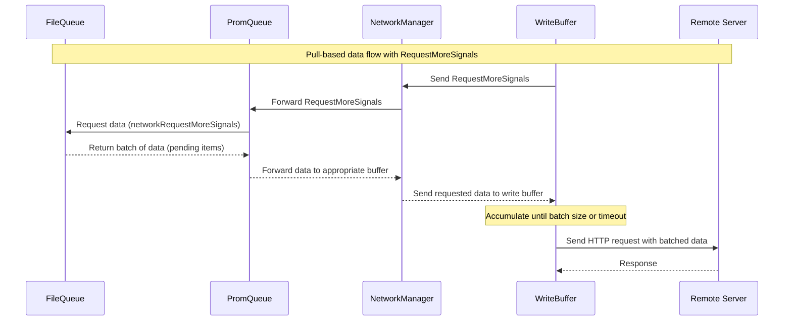

# Data Flow

This diagram illustrates the pull-based data flow implemented in the walqueue system.

## Flow Description

1. WriteBuffer components initiate the data flow by sending RequestMoreSignals to the NetworkManager
2. NetworkManager forwards these requests to the Queue component
3. Queue requests data from the FileQueue with networkRequestMoreSignals channel
4. FileQueue returns a batch of pending items
5. Data flows back through the system to the appropriate WriteBuffer
6. WriteBuffer accumulates data until batch size or timeout is reached
7. WriteBuffer sends HTTP request to the remote server